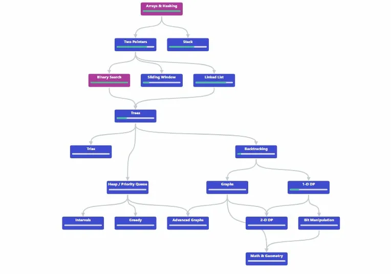

# PROBACODE — MVP Specification

> _NeetCode for Probability_
> Version 1.0 · February 2026 · Mohamed Lemine MOHAMED

---

## 1. Executive Summary

ProbaCode is a structured, pattern-based interview preparation platform for probability and statistics, designed specifically for Qaunt role (research, quantitative development ..etc). Inspired by NeetCode's success in organizing coding interview preparation by patterns, ProbaCode applies the same methodology to probability problems.

The platform features an interactive dependency graph (roadmap) that visualizes how probability topics connect and build upon each other. Each node in the graph represents a pattern containing curated problems with progressive difficulty, hints, and detailed solutions rendered with LaTeX.

---

## 2. Problem Statement

Candidates preparing for quantitative and ML interviews face several challenges:

- No structured learning path for probability interview questions (unlike LeetCode/NeetCode for coding)
- Scattered resources across textbooks, forums, and PDFs with no clear progression
- Difficulty identifying which probability patterns are most relevant for their target role
- No way to track progress across the full landscape of probability topics

**ProbaCode solves this** by organizing probability problems into a visual, pattern-based roadmap.

---

## 3. Target Users

| Persona                      | Description                                                                 | Key Needs                                                       |
| ---------------------------- | --------------------------------------------------------------------------- | --------------------------------------------------------------- |
| **Quant Trader Candidate**   | Finance/Math grad targeting trading firms (Jane Street, Citadel, Two Sigma) | Brain teasers, gambling problems, expected value, Markov chains |
| **Quant Dev Candidate**      | CS/Math grad targeting quant development roles                              | Probability fundamentals, stochastic processes, simulation      |
| **ML Researcher Candidate**  | Grad student or professional targeting ML research roles (FAANG, DeepMind)  | Statistics, Bayesian inference, MLE/MAP, bias-variance          |
| **Data Scientist Candidate** | Professional preparing for DS interviews                                    | Hypothesis testing, distributions, conditional probability      |

---

## 4. User Stories

### 4.1 Core User Stories (MVP)

| ID    | As a...         | I want to...                                                                                                         | Priority       |
| ----- | --------------- | -------------------------------------------------------------------------------------------------------------------- | -------------- |
| US-01 | Visitor         | See an interactive roadmap of all probability patterns and their dependencies so I understand the full learning path | 🔴 Must Have   |
| US-02 | Visitor         | Click a pattern node to see all problems in that category, sorted by difficulty                                      | 🔴 Must Have   |
| US-03 | Visitor         | Open a problem and see the full statement with properly rendered math (LaTeX)                                        | 🔴 Must Have   |
| US-04 | Visitor         | Reveal progressive hints before looking at the full solution                                                         | 🔴 Must Have   |
| US-05 | Visitor         | See the complete solution with step-by-step mathematical derivation                                                  | 🔴 Must Have   |
| US-06 | Registered User | Create an account via Google or GitHub OAuth                                                                         | 🔴 Must Have   |
| US-07 | Registered User | Mark problems as completed and see my progress reflected on the roadmap graph                                        | 🔴 Must Have   |
| US-08 | Registered User | See an overall progress dashboard showing completion by pattern                                                      | 🔵 Should Have |
| US-09 | Visitor         | Access the platform on mobile with a responsive layout                                                               | 🔵 Should Have |
| US-10 | Visitor         | Find the site via search engines when searching for probability interview prep                                       | 🔴 Must Have   |

### 4.2 Future User Stories (Post-MVP)

- **US-11:** Spaced repetition reminders for problems I struggled with
- **US-12:** Discussion threads and community solutions on each problem
- **US-13:** Submit my own problems for community review
- **US-14:** Video explanations for the most complex problems
- **US-15:** Timed mock quizzes simulating real interview conditions

---

## 5. Feature Breakdown

### 5.1 Interactive Roadmap Graph

The core differentiator of ProbaCode. A visual, interactive graph built with React Flow that displays all probability patterns as nodes connected by prerequisite edges.

- Each node shows: pattern name and completion percentage with progress bar
- Nodes are color-coded by progress: ⬜ gray (not started), 🟡 yellow (in progress), 🟢 green (completed)
- Clicking a node navigates to the pattern detail page
- Edges show prerequisite relationships
- Zoom, pan, and responsive layout for all screen sizes



### 5.2 Pattern Pages

Each pattern has a dedicated page listing all problems within that category:

- Pattern description and key concepts overview
- Problem list sorted by difficulty (Easy, Medium, Hard)
- Completion status indicator for each problem (logged-in users)


### 5.3 Problem Pages

The core learning experience. Each problem page includes:

- Problem statement with LaTeX-rendered mathematics (KaTeX)
- Difficulty badge and role tags
- Progressive hints (reveal one at a time)
- Full solution with step-by-step derivation (collapsible)
- "Mark as completed" button (logged-in users)

### 5.4 Authentication & Progress Tracking

Lightweight auth system powered by Supabase:

- OAuth login via Google and GitHub
- Progress stored in Postgres: problem completion status and timestamps
- Progress reflected in real-time on the roadmap graph and pattern pages
- No account required to browse (anonymous access supported)

### 5.5 Profile Page

Personal dashboard for registered users:

- Display name, avatar, and account info (pulled from OAuth provider)
- Overall completion stats: total problems solved, patterns completed, current streak
- Progress breakdown by pattern (progress bars)
- Activity heatmap showing daily practice (GitHub-style contribution graph)


### 5.6 SEO & Discoverability

Critical for organic growth. Next.js SSR ensures all content is indexable:

- Server-side rendered pages with proper meta tags
- Structured data (JSON-LD) for educational content
- Sitemap generation for all problem and pattern pages
- Fast load times via Vercel edge network

---

## 6. Pattern Taxonomy (Content Structure)

The following taxonomy defines the pattern graph. Each pattern is a node; edges represent prerequisite relationships.

| Pattern                       | Key Topics                                                      | #Prob |
| ----------------------------- | --------------------------------------------------------------- | :---: |
| Counting & Combinatorics      | Permutations, combinations, inclusion-exclusion, pigeonhole     |   6   |
| Conditional Prob. & Bayes     | Bayes' theorem, law of total probability, updating beliefs      |   5   |
| Independence & Events         | Joint events, mutual exclusivity, conditional independence      |   4   |
| Discrete Distributions        | Binomial, Poisson, Geometric, Negative Binomial, Hypergeometric |   6   |
| Continuous Distributions      | Normal, Exponential, Uniform, Gamma, Beta                       |   5   |
| Joint Distributions           | Marginals, covariance, correlation, transformations             |   4   |
| Linearity of Expectation      | Indicator variables, decomposition trick, symmetry              |   7   |
| Conditional Expectation       | Tower property, iterated expectations, Adam's law               |   5   |
| Moment Generating Functions   | MGF uniqueness, computing moments, sum of RVs                   |   3   |
| Coupon Collector              | Expected collection time, generalizations, variations           |   4   |
| Random Walks & Gambler's Ruin | Absorption probabilities, expected duration, reflection         |   5   |
| Balls & Bins / Birthday       | Birthday paradox, hash collisions, load balancing               |   4   |
| Order Statistics              | Min/max distributions, kth order, spacings                      |   3   |
| Markov Chains                 | Transition matrices, steady state, absorbing chains             |   5   |
| Poisson Processes             | Inter-arrival times, merging, thinning, conditioning            |   4   |
| Brownian Motion               | Properties, scaling, hitting times, reflection principle        |   3   |
| Martingales                   | Optional stopping, convergence, gambling applications           |   3   |
| MLE & MAP Estimation          | Maximum likelihood, prior selection, conjugate priors           |   4   |
| Hypothesis Testing            | Type I/II errors, p-values, power, multiple testing             |   4   |
| Bayesian Inference            | Posterior computation, credible intervals, model comparison     |   4   |
| Bias-Variance Tradeoff        | Decomposition, overfitting, regularization                      |   3   |

**Total MVP problems: ~90 curated problems across 21 patterns.**

### Dependency Graph

```
Fundamentals ──→ Conditional & Bayes ──→ Independence
    │                    │                     │
    ▼                    ▼                     ▼
Discrete Dist.    Continuous Dist.       Joint Dist. ──────→ MLE & MAP
    │                    │                     │                  │
    ▼                    ▼                     ▼                  ▼
Linearity of E    Conditional E            MGFs          Hypothesis Testing
    │                    │                     │              │         │
    ├──→ Coupon          ▼                     ▼              ▼         ▼
    ▼    Collector    Balls & Bins       Order Stats    Bayesian   Bias-Variance
Random Walks             │
    │                    ▼
    ▼              Poisson Process
Markov Chains
    │
    ├──→ Brownian Motion
    └──→ Martingales
```

---

## 7. Tech Stack

| Layer              | Technology                   | Rationale                                                   |
| ------------------ | ---------------------------- | ----------------------------------------------------------- |
| **Framework**      | Next.js 15+ (App Router)     | SSR for SEO, API routes, all-in-one full-stack framework    |
| **Language**       | TypeScript                   | Type safety across frontend and backend, better DX          |
| **Styling**        | Tailwind CSS                 | Utility-first, fast iteration, consistent design system     |
| **UI Components**  | shadcn/ui                    | Accessible, Tailwind-native, production-grade components    |
| **Graph**          | React Flow                   | Interactive node graph, perfect for NeetCode-style roadmaps |
| **Math Rendering** | KaTeX (rehype-katex)         | Fast LaTeX rendering, 10x faster than MathJax               |
| **Content**        | MDX (next-mdx-remote)        | Markdown + JSX, LaTeX-native, version controlled in Git     |
| **Auth**           | Supabase Auth                | OAuth (Google, GitHub), free tier, managed sessions         |
| **Database**       | Supabase Postgres            | User progress tracking, serverless, generous free tier      |
| **Deployment**     | Vercel                       | Zero-config Next.js hosting, edge CDN, preview deployments  |
| **Analytics**      | Plausible / Vercel Analytics | Privacy-friendly, lightweight, GDPR compliant               |

---

## 8. System Architecture

### 8.1 High-Level Architecture

```
[Browser]  <-->  [Vercel Edge CDN]  <-->  [Next.js App]
                                                |
                             +------------------+------------------+
                             |                                     |
                    [MDX Content Files]             [Supabase (Auth + DB)]
                    /content/problems/              user_progress table
                    /content/roadmap.json
```

### 8.2 Project Structure

```
probacode/
├── app/
│   ├── page.tsx                  # Landing page
│   ├── layout.tsx                # Root layout + providers
│   ├── roadmap/
│   │   └── page.tsx              # Interactive graph (React Flow)
│   ├── patterns/
│   │   └── [slug]/
│   │       └── page.tsx          # Pattern detail + problem list
│   ├── problems/
│   │   └── [slug]/
│   │       └── page.tsx          # Problem + hints + solution
│   └── api/
│       └── progress/
│           └── route.ts          # GET/POST user progress
├── components/
│   ├── roadmap-graph.tsx         # React Flow graph component
│   ├── problem-card.tsx          # Problem list item
│   ├── hint-accordion.tsx        # Progressive hint reveal
│   ├── solution-block.tsx        # Collapsible solution
│   ├── mdx-components.tsx        # Custom MDX renderers
│   └── auth-button.tsx           # Login/logout
├── content/
│   ├── roadmap.json              # Graph nodes + edges
│   └── problems/
│       ├── coupon-collector.mdx
│       ├── gamblers-ruin.mdx
│       └── ...
├── lib/
│   ├── supabase.ts               # Supabase client
│   ├── mdx.ts                    # MDX parsing utilities
│   └── problems.ts               # Content loading helpers
├── public/
└── tailwind.config.ts
```

### 8.3 Database Schema

| Column                    | Type        | Constraint                    | Description                     |
| ------------------------- | ----------- | ----------------------------- | ------------------------------- |
| `id`                      | uuid        | PRIMARY KEY                   | Auto-generated unique ID        |
| `user_id`                 | uuid        | FK → auth.users               | Supabase auth user reference    |
| `problem_slug`            | text        | NOT NULL                      | Matches MDX filename            |
| `status`                  | text        | CHECK(attempted \| completed) | Current completion status       |
| `completed_at`            | timestamptz | DEFAULT now()                 | Timestamp of last status change |
| `(user_id, problem_slug)` | —           | UNIQUE                        | One record per user per problem |

```sql
CREATE TABLE user_progress (
  id            uuid DEFAULT gen_random_uuid() PRIMARY KEY,
  user_id       uuid REFERENCES auth.users(id),
  problem_slug  text NOT NULL,
  status        text CHECK (status IN ('attempted','completed')) NOT NULL,
  completed_at  timestamptz DEFAULT now(),
  UNIQUE(user_id, problem_slug)
);
```

### 8.4 MDX Content Format

Each problem is a self-contained MDX file with frontmatter metadata:

```mdx
---
title: "Coupon Collector Problem"
pattern: "coupon-collector"
difficulty: "medium"
roles: ["quant-trader", "quant-researcher"]
tags: ["expectation", "linearity-of-expectation", "harmonic-series"]
order: 1
---

## Problem

There are $n$ distinct coupon types. Each time you collect a coupon,
it is equally likely to be any of the $n$ types. What is the expected
number of coupons you need to collect to get all $n$ types?

<Hints>
	<Hint n={1}>Think about breaking the process into phases.</Hint>
	<Hint n={2}>Phase $i$: going from $i-1$ to $i$ distinct coupons.</Hint>
	<Hint n={3}>What distribution does each phase follow?</Hint>
</Hints>

<Solution>
### Key Insight
Use **linearity of expectation** by decomposing into geometric phases.

$$E[T] = \sum_{i=0}^{n-1} \frac{n}{n-i} = n H_n \approx n \ln n$$

</Solution>
```

### 8.5 Roadmap Graph Data

```json
{
	"nodes": [
		{
			"id": "fundamentals",
			"label": "Probability Fundamentals",
			"problems": 6
		},
		{
			"id": "conditional",
			"label": "Conditional Probability & Bayes",
			"problems": 5
		},
		{
			"id": "expectation",
			"label": "Expectation & Variance",
			"problems": 7
		},
		{
			"id": "coupon-collector",
			"label": "Coupon Collector",
			"problems": 4
		},
		{
			"id": "random-walks",
			"label": "Random Walks & Gambler's Ruin",
			"problems": 5
		},
		{ "id": "markov", "label": "Markov Chains", "problems": 5 }
	],
	"edges": [
		{ "from": "fundamentals", "to": "conditional" },
		{ "from": "conditional", "to": "expectation" },
		{ "from": "expectation", "to": "coupon-collector" },
		{ "from": "expectation", "to": "random-walks" },
		{ "from": "random-walks", "to": "markov" }
	]
}
```

---

## 9. Task Breakdown & Timeline

The MVP is scoped to a **5-week sprint** with focused deliverables each week.

### Week 1: Foundation & Content Pipeline

| #   | Task                                                                  | Est. | Status   |
| --- | --------------------------------------------------------------------- | ---- | -------- |
| 1.1 | Initialize Next.js 14 project with TypeScript and Tailwind            | 2h   | ⬜ To Do |
| 1.2 | Configure MDX pipeline (next-mdx-remote + remark-math + rehype-katex) | 3h   | ⬜ To Do |
| 1.3 | Build MDX component library (Hints, Solution, custom math blocks)     | 4h   | ⬜ To Do |
| 1.4 | Create content schema and write 5 sample problems in MDX              | 4h   | ⬜ To Do |
| 1.5 | Build problem page with LaTeX rendering and hint/solution toggles     | 4h   | ⬜ To Do |
| 1.6 | Set up shadcn/ui and global design tokens                             | 2h   | ⬜ To Do |

### Week 2: Interactive Roadmap

| #   | Task                                                        | Est. | Status   |
| --- | ----------------------------------------------------------- | ---- | -------- |
| 2.1 | Define roadmap.json with all 21 pattern nodes and edges     | 3h   | ⬜ To Do |
| 2.2 | Build React Flow roadmap component with custom node styling | 6h   | ⬜ To Do |
| 2.3 | Implement pattern detail pages with problem listing         | 4h   | ⬜ To Do |
| 2.4 | Add difficulty badges, role tags, and filtering             | 3h   | ⬜ To Do |
| 2.5 | Responsive layout for roadmap (mobile and desktop)          | 3h   | ⬜ To Do |

### Week 3: Auth & Progress Tracking

| #   | Task                                                             | Est. | Status   |
| --- | ---------------------------------------------------------------- | ---- | -------- |
| 3.1 | Set up Supabase project (Auth + Postgres)                        | 2h   | ⬜ To Do |
| 3.2 | Implement OAuth login/logout (Google + GitHub)                   | 4h   | ⬜ To Do |
| 3.3 | Create user_progress table and API routes                        | 3h   | ⬜ To Do |
| 3.4 | Build mark-as-completed UI on problem pages                      | 3h   | ⬜ To Do |
| 3.5 | Connect progress data to roadmap node colors (gray/yellow/green) | 4h   | ⬜ To Do |
| 3.6 | Build progress dashboard with completion stats                   | 3h   | ⬜ To Do |

### Week 4: Content Sprint

| #   | Task                                                                          | Est. | Status   |
| --- | ----------------------------------------------------------------------------- | ---- | -------- |
| 4.1 | Write 20 problems: core patterns (Counting, Conditional, Expectation)         | 8h   | ⬜ To Do |
| 4.2 | Write 15 problems: interview classics (Coupon Collector, Random Walk, Markov) | 6h   | ⬜ To Do |
| 4.3 | Write 15 problems: ML/Stats patterns (MLE, Hypothesis Testing, Bayes)         | 6h   | ⬜ To Do |
| 4.4 | Write remaining 40 problems across all other patterns                         | 16h  | ⬜ To Do |
| 4.5 | Review all solutions for mathematical accuracy                                | 4h   | ⬜ To Do |

### Week 5: Polish, SEO & Launch

| #   | Task                                                        | Est. | Status   |
| --- | ----------------------------------------------------------- | ---- | -------- |
| 5.1 | Landing page design and copywriting                         | 4h   | ⬜ To Do |
| 5.2 | SEO: meta tags, sitemap, structured data (JSON-LD)          | 3h   | ⬜ To Do |
| 5.3 | Performance optimization (ISR, image opt., bundle analysis) | 3h   | ⬜ To Do |
| 5.4 | Cross-browser and mobile testing                            | 2h   | ⬜ To Do |
| 5.5 | Set up analytics (Plausible or Vercel Analytics)            | 1h   | ⬜ To Do |
| 5.6 | Deploy to Vercel production + custom domain                 | 2h   | ⬜ To Do |
| 5.7 | Soft launch: share on Reddit, Twitter, Hacker News          | 2h   | ⬜ To Do |

---

## 10. Success Metrics (MVP)

| Metric                     | Target (Month 1) | Target (Month 3) |
| -------------------------- | :--------------: | :--------------: |
| Monthly Active Users       |       500        |      2,000       |
| Registered Users           |       100        |       500        |
| Problems Completed (total) |      1,000       |      10,000      |
| Avg. Session Duration      |     > 5 min      |     > 8 min      |
| Organic Search Traffic     |  20% of visits   |  40% of visits   |
| Problem Completion Rate    |      > 30%       |      > 40%       |

---

## 11. Post-MVP Roadmap

### Phase 2: Engagement (Month 2–3)

- Spaced repetition system for weak patterns
- Timed mock quizzes simulating real interview conditions
- Discussion threads on each problem (community solutions)
- Dark mode

### Phase 3: Monetization (Month 4–6)

- Freemium model: 30% of problems free, full access via subscription ($9–15/month)
- Company-specific problem packs (Jane Street, Citadel, Two Sigma, Google)
- Premium features: video walkthroughs, solution explanations

### Phase 4: Community & Scale (Month 6+)

- User-submitted problems with review and approval workflow
- Leaderboard and streak system
- API for universities and bootcamps to embed problems
- Expand to adjacent topics: linear algebra, algorithms for quant

---

## 12. Risks & Mitigations

| Risk                        | Impact  | Likelihood | Mitigation                                                   |
| --------------------------- | ------- | ---------- | ------------------------------------------------------------ |
| Content quality issues      | 🔴 High | Medium     | Peer review, reference textbooks (Blitzstein, Ross)          |
| Low initial traffic         | Medium  | 🔴 High    | SEO-first approach, Reddit/Twitter launch, content marketing |
| LaTeX rendering bugs        | Medium  | Low        | KaTeX is battle-tested; fallback to MathJax if needed        |
| Competitor launches similar | Medium  | Low        | First-mover advantage, focus on content depth                |
| Scope creep beyond MVP      | 🔴 High | Medium     | Strict 5-week deadline, defer all non-essential features     |

---

<p align="center"><em>End of MVP Specification</em></p>
<p align="center"><strong>ProbaCode — Master Probability, Ace the Interview</strong></p>
